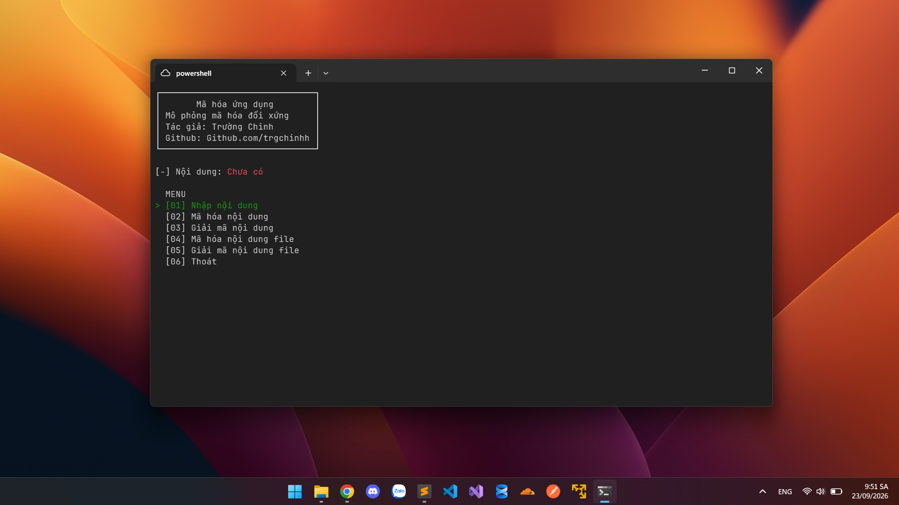

# TRIỂN KHAI MÃ HÓA ĐỐI XỨNG BẰNG C#

<p align="center">
  
</p>

<p align="center">
  <a href="https://github.com/trgchinhh/mophong-mahoabatdoixung">
    
  </a>
  <a href="LICENSE">
    
  </a>
  <a href="https://github.com/trgchinhh">
    
  </a>
</p>

Chương trình nhỏ mô phỏng thuật toán mã hóa nhỏ tự build



---

## Giới thiệu

- **Mã hóa:** là khái niệm luôn có 2 chiều là mã hóa <-> giải mã, có khóa để giải mã (key), độ dài không cố định. Dùng để trao đổi dữ liệu mà không sợ bên thứ 3 đọc được

- **Hàm băm (hash):** là khái niệm 1 chiều, độ dài không đổi tùy thuật toán sẽ cho ra độ dài cố định khác nhau. Dùng để kiểm tra tính toàn vẹn dữ liệu

---

## Thành phần

- `P`: nội dung (bản rõ)
- `C`: nội dung sau mã hóa (bản mã)
- `K1`: khóa 1
- `K2`: khóa 2
- `R`: số vòng lặp

---

## Các phép biến đổi

- `XOR`: khác bit là 1 giống bit là 0
- `NOT`: đảo bit 1 là 0, 0 là 1
- `ROTL 3`: xoay trái 3 bit | vd: `110 1110 -> 1110 110`
- `ROTR 3`: xoay phải 3 bit | vd: `110 1110 -> 110 1101`
- `mod`: phép chia lấy dư (%)

---

## Công thức lấy khóa

```
K1[i] = K1[(i + k) mod |K1|]
K2[i] = K2[(i + k) mod |K2|]
```

- trong đó `K1[i]` là byte thứ i trong vòng lặp
- `k` là vòng lặp thứ k của R
- `|K1|`, `|K2|` là chiều dài khóa 1, 2

**Vì sao phải mod khúc này?**

Vì khóa thường ngắn hơn nội dung nên mod để lặp lại bằng với dữ liệu

```
noidung            = Nguyen Truong Chinh
khoa               = 1234
sau khi mod khóa   = 1234123412341234123 (đủ chiều dài)
```

---

## Công thức mã hóa

Lặp R lần:

1. `C = P XOR K1[i]` — Bước 1: C là nội dung ban đầu XOR với từng ký tự (byte) của Key 1
2. `C = NOT(C)` — Bước 2: C phủ định lại C
3. `C = ROTL(C, 3)` — Bước 3: C xoay trái 3 bit
4. `C = C XOR K2[i]` — Bước 4: C XOR với từng ký tự (byte) của Key 2

```
[*] Công thức chung: C = ROTL(NOT(P XOR K1[i]), 3) XOR K2[i]
```

---

## Công thức giải mã

Lặp R lần:

1. `C = C XOR K2[i]` — Bước 1: C XOR lại với từng ký tự (byte) của Key 2 để quay lại trạng thái trước khi XOR
2. `C = ROTR(C, 3)` — Bước 2: C xoay phải 3 bit
3. `C = NOT(C)` — Bước 3: C phủ định lần nữa với C
4. `P = C XOR K1[i]` — Bước 4: C XOR với từng ký tự (byte) của Key 1 quay về nội dung ban đầu

```
[*] Công thức chung: P = NOT(ROTR(C XOR K2[i], 3)) XOR K1[i]
```

---

## Quá trình

- Quá trình chạy sẽ chạy R vòng mã hóa và giải mã do người dùng nhập
- Quá trình mã hóa sẽ chạy từ vòng 0 -> R - 1
- Riêng quá trình giải mã sẽ được thực hiện theo thứ tự vòng ngược lại từ (R - 1) -> 0

---

## Đút kết

Quy trình tạo công thức mã hóa và giải mã cho thấy từng bước đối lập nhau để giải mã hóa được

```
MÃ HÓA       │     GIẢI MÃ
─────────────┼───────────────
 - bước 1    │    - bước 4
 - bước 2    │    - bước 3
 - bước 3    │    - bước 2
 - bước 4    │    - bước 1
```

## Cách cài đặt 
```bash
git clone  https://github.com/trgchinhh/Symmetric-encryption.git
cd .\Symmetric-encryption
dotnet run
```

---

## Tác giả
**Nguyễn Trường Chinh (NTC++)**<br>
**GitHub:** [https://github.com/trgchinhh](https://github.com/trgchinhh)

---

> 📌 Dự án nhỏ được phát triển với mục đích học tập và nghiên cứu. Mọi góp ý và đóng góp đều được hoan nghênh.
